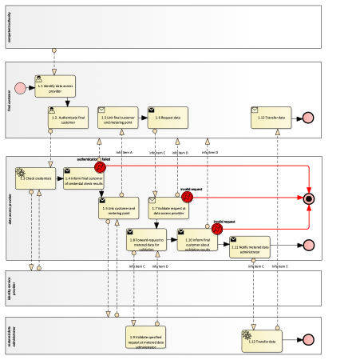

# Reference model for *Use Case Family Name*

## Context/ Whereas

(1)     It was identified that it is advantageous for data sharing and the eligible party working with that data, that metering and consumption data series refer to the metering point identifier and be independent from the underlying physical metering equipment. That means, that if the underlying physical metering equipment is changed, the metering point identifier doesn’t change.

(2)     For the purpose of this act, 'accounting point master data' shall refer to [TODO].

## Definitions

In this section, each term is defined:

* 'term1', in the context of this act, means ...

## Responsibilities of Market Roles

In this section the responsibilities of each market role should be described.

### Responsibilities of energy community operators

1. Metering point administrators shall make metering point master data available online to final customers and eligible parties, without undue delay and whenever the final customer needs to access or share the data.
2. Metering point administrators shall ensure that final customers can access and make available to eligible parties their validated metered data and receive it in a structured, commonly used, machine-readable and interoperable format.

### Responsibitilies of metering point administrators

1. Metered data administrators shall ensure the equal treatment of all eligible parties.

## Annex

Table I contains information needed by eligible parties to set up for utilising connection point master data access in a Member State. It is primarily describing information that needs to be accessible for them to register, onboard or establish prerequisite infrastructure to take part in the procedures listed in Table III.

### General Information

| ID  | Name                         | Description                                                                                                                                                                                                           |
|-----|------------------------------|-----------------------------------------------------------------------------------------------------------------------------------------------------------------------------------------------------------------------|
| I1  | National competent authority | *Name* - Name of appointed national competent authority. *Website* - Website of appointed national competent authority. *Official contact* - Contact details for managing the mappings of national practices. |
| I2  | National info point for energy communities  | *Name* - Name y. *Website* - . *Official contact* - Contact details.  |
| I3  | Available types of collective self-consumption schemas | e.g. <ul><li>Jointly acting self-consumers</li><li>Local Renewable Energy Community</li><li>Regional Renewable Energy Community</li><li>Citizen Energy Community</li><ul>  |
| I4  | National names of type(s) of communit(ies) mapping to Article 2 (15) of Directive (EU) 2018/2001​ | e.g. Gemeinschaftliche Erzeugungsanlagen  |
| I5  | National names of type(s) of communit(ies) mapping to Articles 16 and (22) of Directive (EU) 2018/2001​ | legal entities, whose primary objective is to provide environmental, economic or social community benefits to its members or shareholders through the development, management and operation of renewable energy projects. e.g. <ul><i>Lokale Erneuerbare Energie-Gemeinschaft</li><li>Regionale Erneuerbare Energie-Gemeinschaft</li></ul>  |
| I6  | National names of type(s) of communit(ies) mapping to Article 2(28) 16 and 22 of Directive (EU) 2019/944​​ | legal entities, whose primary objective is to provide environmental, economic or social community benefits to its members or shareholders through the development, management and operation of renewable energy projects. e.g. <ul><li>Bürgerenergiegemeinschaft</li></ul>  |

### Relevant Roles

| Role name                                | Role type | Role description                                                                                                                            |
|------------------------------------------|-----------|---------------------------------------------------------------------------------------------------------------------------------------------|
| Final customer                           | Business  | A party connected to the grid that purchases electricity for its own use. Please note, that this also includes the case of active customer. |
| Energy community operator                | Business  | A party responsible for organising an Energy Community, settlement and billing. |
| Metering point administrator             | Business  | A party responsible for administrating and making available the Metering Point characteristics, including registering the parties linked to the Metering Point. |
| Metered data administrator               | Business  | see Commission Implementing Regulation 2023/1162 |
| Self-consumption calculation responsible | Business  | A party responsible for calculating residual energy and the distribution of self-consumption within an Energy Community. |
| Energy community platform operator       | Business  | A party responsible for developing, maintaining and operating a digital platform for the operation of a single energy community or multiple energy communities. |
| Energy community member | Business       | Member of an energy community |

### Procedures

| No. | Procedure Name                              | Primary Actor  | Preconditions                                         |
|-----|---------------------------------------------|----------------|-------------------------------------------------------|
| 1   | Direct access to data by the final customer | Final customer | Final customer has access at the data access provider |
| 2   | ECO requests accounting point to be added to community | Energy community operator | Energy Community is established. |
| 3   | ECO requests accounting point to be removed from community | Energy community operator | Accounting point is part of EC. |
| 4   | Final customer requests accounting point to be removed from community | Final customer | Accounting point is part of EC. |
| 5   | ECO queries if accounting point may be added to community | Energy community operator |  Energy Community is established. |
| 6   | Final customer queries if accounting point may be added to community | Final customer |  Energy Community is established. |
| 7   | Receive self-consumption information for Energy Community | Self-consumption calculation responsible |  Energy Community is established and accounting points are added to community. |
| 8   | Query energy community master data | Energy community operator |  Energy Community is established. |
| 9   | Change distribution of energy within community | Energy community operator |  Energy Community is established. |

In the following, each procedure is described in steps, whilst each step represents an information exchange between two roles. Each procedure is visualised using a BPMN diagram.

#### Procedure 1 - Access to validated historical consumption data by the final customer

| Step No. | Step                                   | Step description                                                                                                     | Info producer        | Info consumer  | Information exchanged             |
|----------|----------------------------------------|----------------------------------------------------------------------------------------------------------------------|----------------------|----------------|-----------------------------------|
| 1.1      | Identify data access provider          | Final customers identify the data access provider that is responsible for their metering points under consideration. | Competent authority  | Final customer | [not relevant]                    |
| 1.2      | Link final customer and metering point | Final customer finds out metering point id to request data for.                                                                                                                    | Data access provider | Final customer | A - Metering point identification |

#### Procedure 2 - ...

### Data Exchanged

| ID  | Name of information object   | Definition of attributes of exchanged information object                                                                                                      |
|-----|------------------------------|---------------------------------------------------------------------------------------------------------------------------------------------------------------|
| A   | Metering point identificator | Unique identifier for the metering point within the metered data administrator’s meter identification space.                                                  |
| B   | Metered data specification   | *Reading start timestamp* - Start of the interval covered by the data package. *Reading end timestamp* - End of the interval covered by the data package. |
|     |                              |                                                                                                                                                               |

