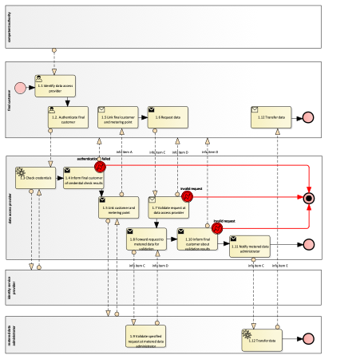

# Reference model for *Collective Self-Consumption*

change..

## Context/ Whereas

(1)     It was identified that it is advantageous for data sharing and the eligible party working with that data, that metering and consumption data series refer to the metering point identifier and be independent from the underlying physical metering equipment. That means, that if the underlying physical metering equipment is changed, the metering point identifier doesn’t change.

(2)     For the purpose of this act, 'accounting point master data' shall refer to [TODO].

## Definitions

In this section, each term is defined:

* 'term1', in the context of this act, means ...

## Responsibilities of Market Roles

In this section the responsibilities of each market role should be described.

### Responsibilities of energy community operators

1. Metering point administrators shall make metering point master data available online to final customers and eligible parties, without undue delay and whenever the final customer needs to access or share the data.
2. Metering point administrators shall ensure that final customers can access and make available to eligible parties their validated metered data and receive it in a structured, commonly used, machine-readable and interoperable format.

### Responsibitilies of metering point administrators

1. Metered data administrators shall ensure the equal treatment of all eligible parties.

## Annex

Table I contains information needed by eligible parties to set up for utilising connection point master data access in a Member State. It is primarily describing information that needs to be accessible for them to register, onboard or establish prerequisite infrastructure to take part in the procedures listed in Table III.

### General Information

| ID  | Name                         | Description                                                                                                                                                                                                           |
|-----|------------------------------|-----------------------------------------------------------------------------------------------------------------------------------------------------------------------------------------------------------------------|
| I1  | National competent authority | *Name* - Name of appointed national competent authority. *Website* - Website of appointed national competent authority. *Official contact* - Contact details for managing the mappings of national practices. |
| I2  | National co-ordination instance | *Name* - Name of the national body intended to help ECs. *Website* *Email* *Phone* *Operational since* *no. as of now* *Comments*                                                                                                                                                                                                                   |
| I3  | National regulatory basis for Jointly Acting Self-Consumers  | *Implemented?* Yes/No *Reference* - to national law *URL* - weblink to national law *Operational since* *no. as of now* *Comments*                                                                                                                                                                                                                   |
| I4  | National regulatory basis for Local Renewable Energy Communities  | *Implemented?* Yes/No *Reference* - to national law *URL* - weblink to national law *Expression of locational vicinity* how is locational vicinity expressed in your regime (e.g. radios of 500m, need to be behind the same secondary substation etc.) *Operational since* *no. as of now* *Comments*                                                                                                                                                                                                                   |
| I5  | National regulatory basis for Regional Renewable Energy Communities  | *Implemented?* Yes/No *Reference* - to national law *URL* - weblink to national law *Expression of locational vicinity* how is locational vicinity expressed in your regime (e.g. radios of 500m, need to be behind the same secondary substation etc.) *Operational since* *no. as of now* *Comments*                                                                                                                                                                                                                   |
| I6  | National regulatory basis for Citizen Energy Communities  | *Implemented?* Yes/No *Reference* - to national law *URL* - weblink to national law *Comments*                                                                                                                                                                                                                   |
| I7  | Settlement process for ECs | Please describe the settlement process for collective self-consumption schema. Who gathers and processes, which data? |
| I8  | Testing possibilities | Please describe a) the testing possibilities that digital platforms for Energy Communities have and b) how they can onboard to these testing facilities. |
| I9  | Onboarding for CU Operators | Description of what needs to be done by Energy Community operators to found an EC and to connect to the relevant energy market communication. |
| I10 | Multi-participation | Indication about how many ECs an accounting point can be part of at the same time. |
| I11 | Self-consumption calculation responsible | List all parties responsible for calculating self-consumption values.  *Name* *URL* *Email* *Contact information* *Grid area responsibility* |
| I12 | Self-consumption participation administrator | List all self-consumption participation administrators.  *Name* *URL* *Email* *Contact information* *Grid area responsibility* |

### Relevant Roles

| Role name                                | Role type | Role description                                                                                                                            |
|------------------------------------------|-----------|---------------------------------------------------------------------------------------------------------------------------------------------|
| Final customer                           | Business  | A party connected to the grid that purchases electricity for its own use. Please note, that this also includes the case of active customer. |
| Energy community operator                | Business  | A party organising and operating an Energy community, doing the settlement of services and - potentially - running an IT infrastructure supporting the fulfillment of these responsibilities.                                                                                                                                         |
| Metering point administrator             | Business  | ...                                                                                                                                         |
| Metered data administrator               | Business  | ...                                                                                                                                         |
| Self-consumption calculation responsible | Business  | A party (or parties) that are responsible for calculating self-generation and self-consumption across all members of a community.                                                                                                                                         |
| Self-consumption participation administrator                                      | Business       | ...                                                                                                                                         |
| Identity service provider                                      | Business       | ...                                                                                                                                         |
| ...                                      | ...       | ...                                                                                                                                         |

### Procedures

| No. | Procedure Name                              | Primary Actor  | Preconditions                                         |
|-----|---------------------------------------------|----------------|-------------------------------------------------------|
| 1   | Direct access to data by the final customer | Final customer | Final customer has access at the data access provider |
| 2   |                                             |                |                                                       |
| 3   |                                             |                |                                                       |
| 4   |                                             |                |                                                       |

In the following, each procedure is described in steps, whilst each step represents an information exchange between two roles. Each procedure is visualised using a BPMN diagram.

#### Procedure 1 - Access to validated historical consumption data by the final customer

| Step No. | Step                                   | Step description                                                                                                     | Info producer        | Info consumer  | Information exchanged             |
|----------|----------------------------------------|----------------------------------------------------------------------------------------------------------------------|----------------------|----------------|-----------------------------------|
| 1.1      | Identify data access provider          | Final customers identify the data access provider that is responsible for their metering points under consideration. | Competent authority  | Final customer | [not relevant]                    |
| 1.2      | Link final customer and metering point | Final customer finds out metering point id to request data for.                                                                                                                    | Data access provider | Final customer | A - Metering point identification |

#### Procedure 2 - ...

### Data Exchanged

| ID  | Name of information object   | Definition of attributes of exchanged information object                                                                                                      |
|-----|------------------------------|---------------------------------------------------------------------------------------------------------------------------------------------------------------|
| A   | Metering point identificator | Unique identifier for the metering point within the metered data administrator’s meter identification space.                                                  |
| B   | Metered data specification   | *Reading start timestamp* - Start of the interval covered by the data package. *Reading end timestamp* - End of the interval covered by the data package. |
|     |                              |                                                                                                                                                               |

